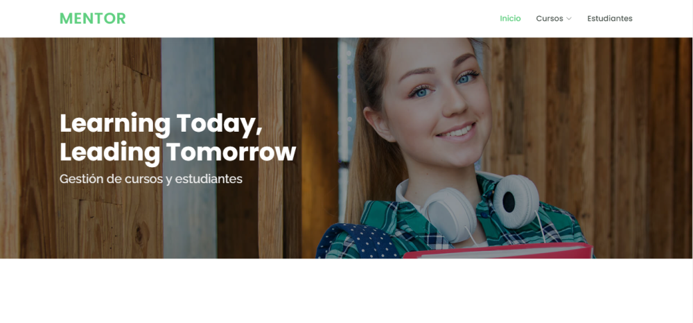
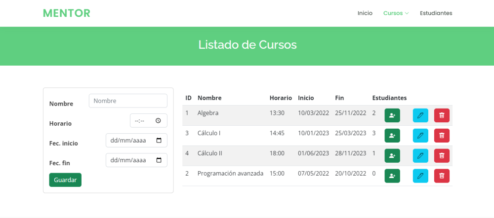
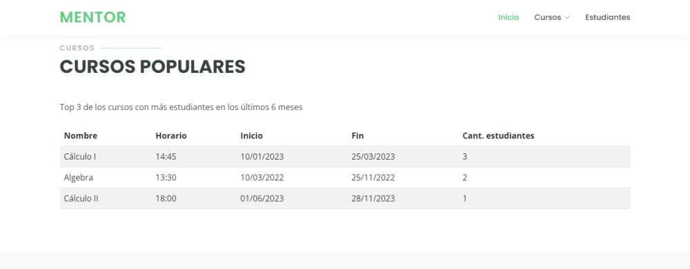
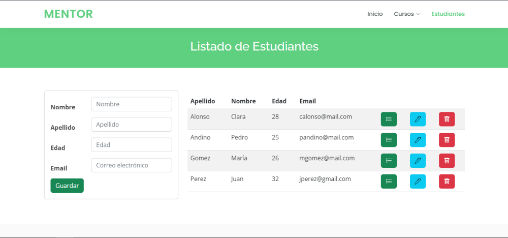

# 🚀 RETO CURSO - Django y Python

## Instalación
```
git clone https://github.com/anakloss/reto-curso.git
cd reto-curso
pip install -r requirements.txt
```

## Objetivo
Construír una aplicación web con Python que permita la gestión de cursos, estudiantes y la asignación entre estos,
teniendo en cuenta que un estudiante puede estar asociado a varios cursos.
* 👉 PostgreSQL
* 👉 Python3
* 👉 Django Framework

## Requerimientos técnicos
### Información requerida para cada entidad
#### Estudiante
* Nombre.
* Apellido.
* Edad.
* Correo electrónico.
* Cursos asociados.

#### Cursos
* Nombre.
* Horario.
* Fecha inicio.
* Fecha fin.
* N° de estudiantes asociados.

### Operaciones requeridas
* 👉 CRUD de estudiantes
* 👉 CRUD de cursos
* 👉 Asignación de estudiante a un curso especifico
* 👉 Consulta del top 3 de los cursos con más estudiantes en los últimos 6 meses
* 👉 Listado de cursos a los que se encuentra asignado un estudiante

## Imagenes DEMO

### Inicio


### Cursos
CRUD de cursos y consulta del top 3




### Estudiantes
CRUD de estudiantes



____________________________________________________

LICENCIA TEMPLATE

© Copyright **Mentor**. All Rights Reserved

Designed by [BootstrapMade](https://bootstrapmade.com/)